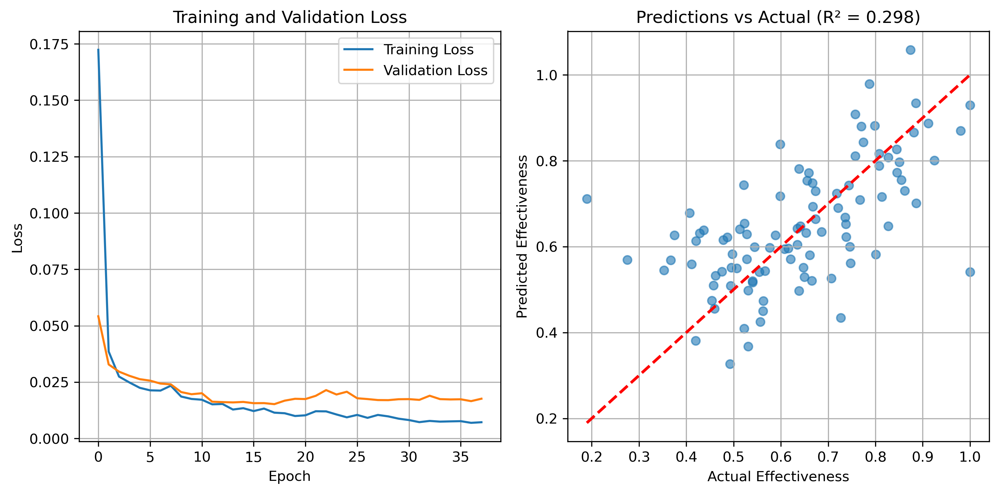
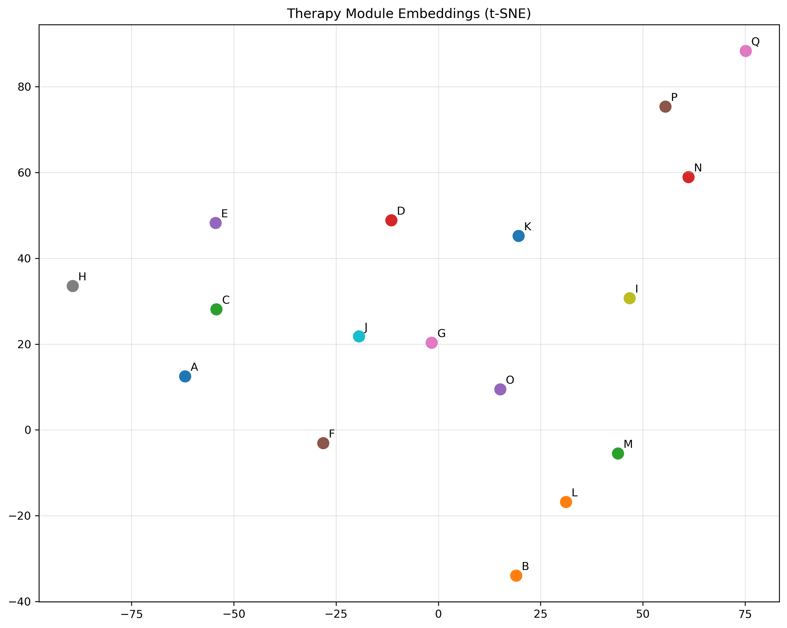

# Sequential modeling of psychotherapy modules to optimize session effectiveness

- Module Embeddings: Each of your 17 therapy modules gets mapped to a learned vector representation
- LSTM Processing: The sequence of embedded modules flows through an LSTM that captures temporal dependencies
- Effectiveness Prediction: The final hidden state predicts the effectiveness score

Features:
1. Data Generation: Creates synthetic therapy sequences with realistic patterns, where certain module combinations (like A→B→A) are more effective.
2. LSTM Model: Uses embeddings + LSTM to capture sequential dependencies while predicting effectiveness scores.
3. Variable Length Handling: Properly handles sequences of different lengths using padding and packing.
4. Training Pipeline: Includes proper train/validation/test splits, early stopping, and learning rate scheduling.

What the Embeddings Tell You
- Modules that appear in similar contexts (e.g., both effective after 'A') will have similar embeddings - revealing therapy patterns.
- Treatment clustering: You might discover that certain modules naturally group together (e.g., crisis intervention modules vs. maintenance modules).
- Sequence prediction: Use embeddings to find "what module typically follows this pattern?" by computing similarities.
- Transfer learning: Pre-trained embeddings could initialize models for related tasks (different effectiveness metrics, patient populations).


Reproduce:

```
conda create -y -n therapy_embeddings python=3.11 seaborn ipywidgets ipykernel torch scikit-learn
conda activate therapy_embeddings 
git clone https://github.com/danielmlow/therapy_embeddings
cd therapy_embeddings 
python3 simulate_train.py
```

See results in the terminal and plots:

Example:

```python

Generating synthetic therapy sequence data...
Generated 500 sequences
Average sequence length: 12.28
Average effectiveness: 0.615
Vocabulary size: 18

Training model...
Epoch [1/100], Train Loss: 0.1724, Val Loss: 0.0542
Epoch [11/100], Train Loss: 0.0172, Val Loss: 0.0201
Epoch [21/100], Train Loss: 0.0103, Val Loss: 0.0175
Epoch [31/100], Train Loss: 0.0082, Val Loss: 0.0175
Early stopping at epoch 38

Test Results:
MSE: 0.0192
R² Score: 0.2979
RMSE: 0.1386

Example subsequence predictions:
Sequence A → B → A: Predicted effectiveness = 0.639
Sequence C → D → C: Predicted effectiveness = 0.616
Sequence A → F → F: Predicted effectiveness = 0.700
Sequence B → C → B: Predicted effectiveness = 0.512
Sequence Q → P → O → N: Predicted effectiveness = 0.558

Model training complete!
The model can now predict effectiveness for new therapy module sequences.

```




```
Modules most similar to A: [('A', np.float32(1.0)), (np.str_('C'), np.float32(0.3570093)), (np.str_('E'), np.float32(0.19056007)), (np.str_('F'), np.float32(0.1291886)), (np.str_('P'), np.float32(0.10729633))]
```


